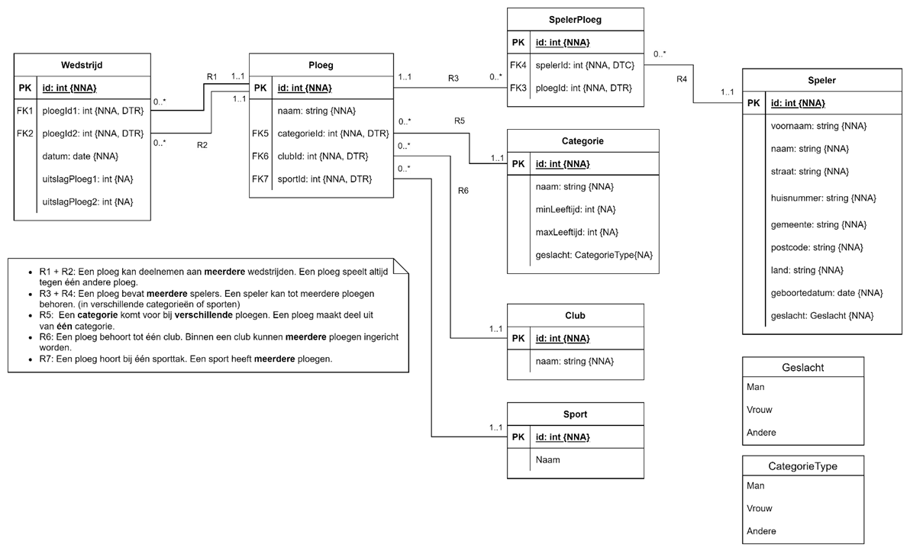
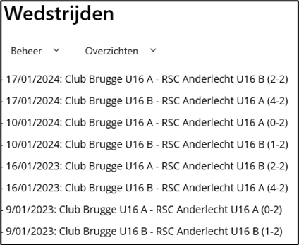
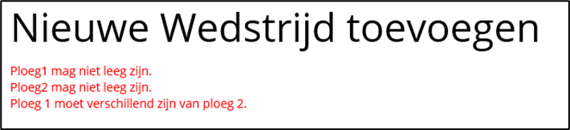
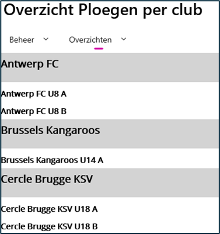
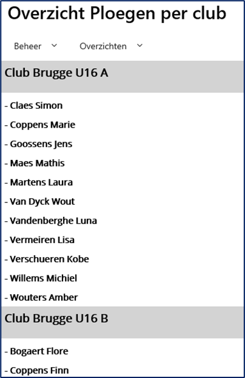
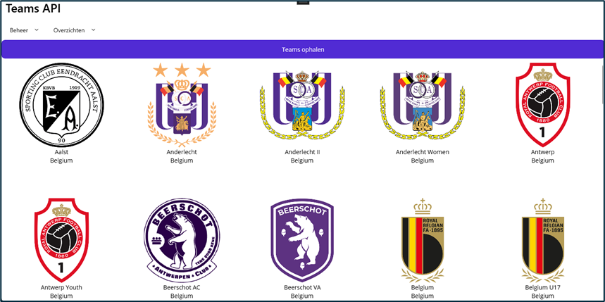

# Opdracht Wedstrijden
## Doel
Het doel van deze opdracht is een bestaand project in .net Maui uitbreiden met extra features. Er moet ook gebruik gemaakt worden van Branches.

## Setup
Op Canvas vind je een link naar een Github Classroom. Je werkt voor deze opdracht verplicht met 2 personen! Op de Classroom maak je voor jouw groepje een team aan. Beide teamleden clonen de startrepo van Github Classroom.

De startbestanden bevatten volgende gegevens:
- Sql waarmee je de database en tabellen kunt aanmaken. Hierin zit ook al dummydata voor de tabellen. Voer deze uit.
- Crud-functionaliteiten voor alle entiteiten behalve Wedstrijd
- Modellen opgesteld volgens onderstaand ERD:

## Opdracht
Gebruik voor elk van onderstaande features een nieuwe branch. Spreek als team af wie welke features aanpakt. Elk teamlid moet 5 features behandelen waarvan minstens één met * (* = moeilijker of opzoekwerk nodig) Als je feature klaar hebt, maak je een pull request aan om te mergen met de main-branch. Een andere student moet echter de pull request reviewen. Dat wil zeggen dat je, in de comments van de pull request, in grote lijnen beschrijft wat er aangepast is in de code. Je verwijdert geen branches.

## Features
1.	Vraag een lijst van de huidige wedstrijden op.

2.	Voorzie een mogelijkheid om een Wedstrijd aan te maken. 
3.	Voorzie een mogelijkheid om een Wedstrijd te verwijderen
4.	Voorzie een mogelijkheid om een Wedstrijd te wijzigen. 
5.	Pas in heel de applicatie de gepaste validatie toe! De foutboodschappen verschijnen in een label onder de titel. Werk efficiënt met methoden! bv
 

6.	Maak een lijst van alle clubs en de bijhorende ploegen. (*) (Onderstaande afbeelding is een voorbeeld en jouw overzicht mag afwijken)
 

7.	Geef een lijst van alle spelers per ploeg. (*) (Onderstaande afbeelding is een voorbeeld en jouw overzicht mag afwijken)
 

8.	Maak een overzicht van hoeveel wedstrijden een ploeg gewonnen, verloren of gelijk gespeeld heeft. Werk efficiënt met methoden.
9.	Er zitten nog fouten in de navigatie. Los deze op.
10.	Maak een nieuwe pagina met bijhorende ViewModel en Models om van volgende API (json) de gegevens binnen te halen en te deserializen.(**)
https://www.thesportsdb.com/api/v1/json/3/search_all_teams.php?s=Soccer&c=Belgium
De pagina moet er als volgt uitzien:
 
